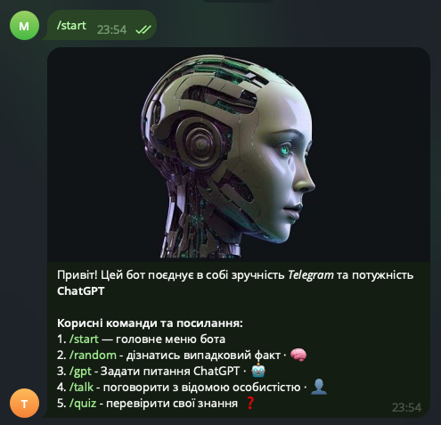
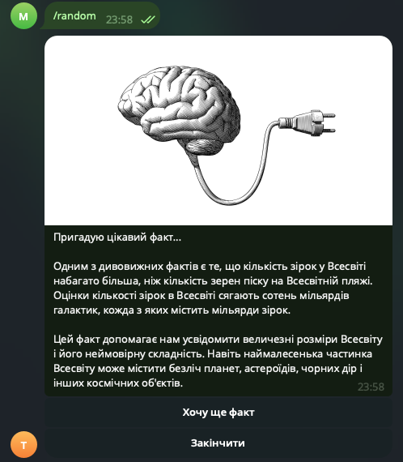
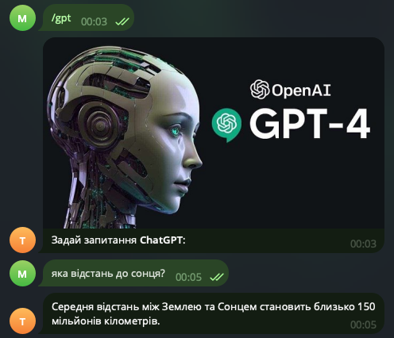
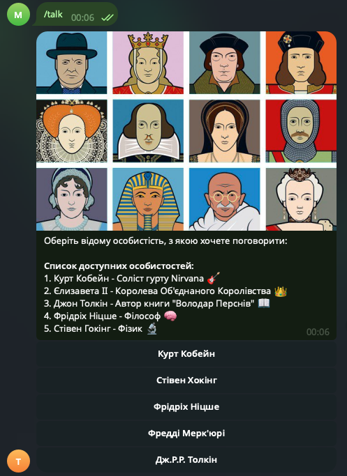
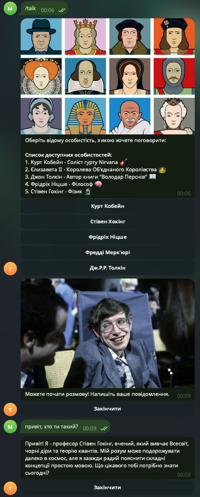
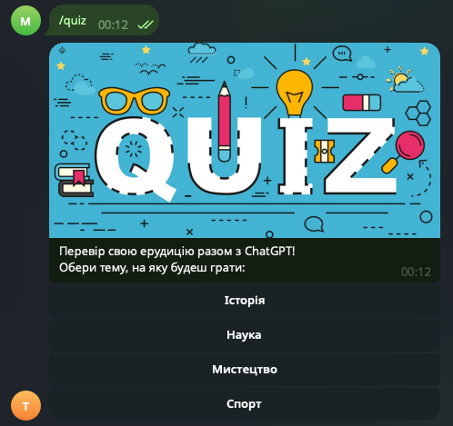
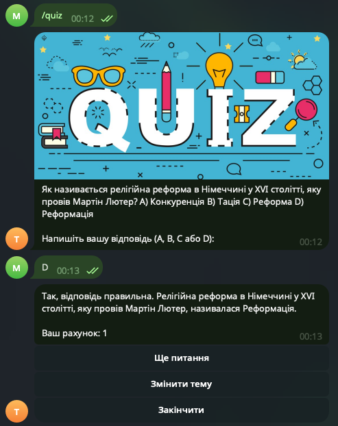
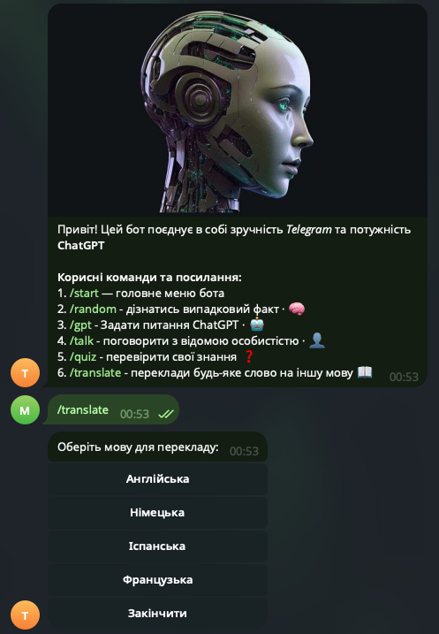
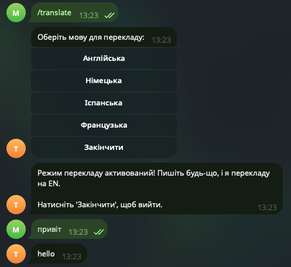

   

# 🤖 OpenAI Telegram Bot

Telegram bot that integrates with OpenAI to provide various interactive features including random facts, GPT chat interface, words translate and personality-based conversations.

Feel the full power of chatGPT assistant!

## 🔧 Setup

1. **First, you need to install some dependencies (modules):**
   
    ```bash
    pip install -r technical_requirements.txt
    ```

2. **Create config file:**
   Create `config.py` with your API keys:
   ```python
   TG_BOT_API_KEY = "your_telegram_bot_token"
   OPENAI_API_KEY = "your_openai_api_key"
   ```

3. **Run the bot:**
   ```bash
   python src/bot/bot.py
   ```

## ✨ Features

- `/start` - welcome message with main menu 
- `/random` - random fact generator with GPT assistant 
- `/gpt` - direct GPT chat interface  
- `/talk` - personality-based conversations (Cobain, Hawking, Nietzsche, Queen, Tolkien)
- `/quiz` - quiz functionality (you can test your knowledge in various fields, such as: history, science, art, sports)
- `/translate` - functionality that allows you to translate any word into several different languages

## ❗ Requirements

- Python 3.8+
- Telegram Bot Token (from @BotFather)
- OpenAI API Key

## 👷 Examples of how the bot works

### 1. command `/start`:

- _general command to start the bot and display its capabilities_



### 2. command `/random`:

- _this functionality provides the ability to generate any random fact_



### 3. command `/gpt`:

- _this functionality allows you to ask anything in the chatGPT_



### 4. command `/talk`:

_this functionality allows you to ask anything to several famous personalities_



- _I choose "Стівен Хокінг (Stephen Hawking)"_



### 5. command `/quiz`:

- _this functionality provides the opportunity to test knowledge in several different fields (history, science, art, sports)_



- _I choose "Історія (History)"_



### 6. command `/translate`:
 
- _this command allows you to translate any word into several different languages_



- _I choose "Англійська (English)"_ 



_This is not a final version of the bot, I will improve it in the future!_