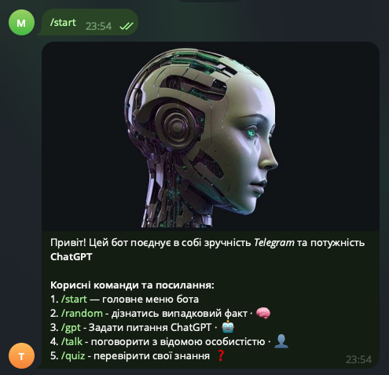
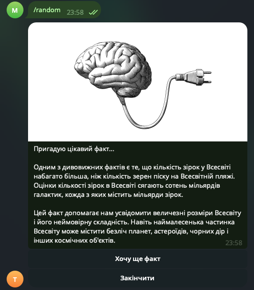
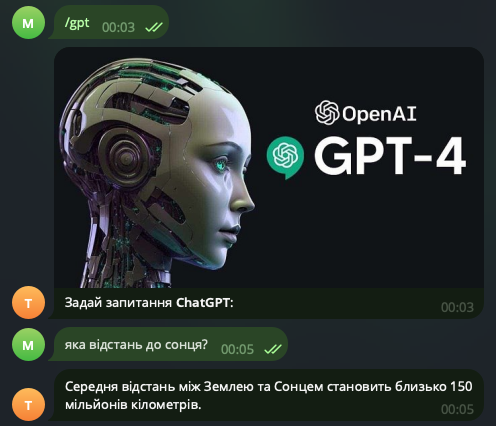
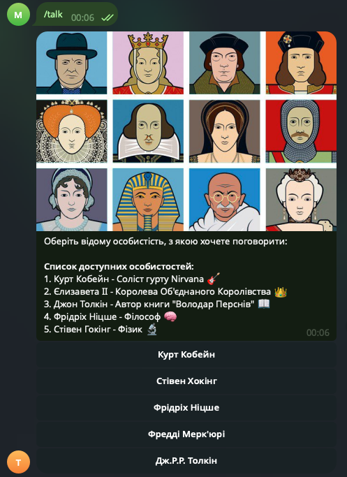
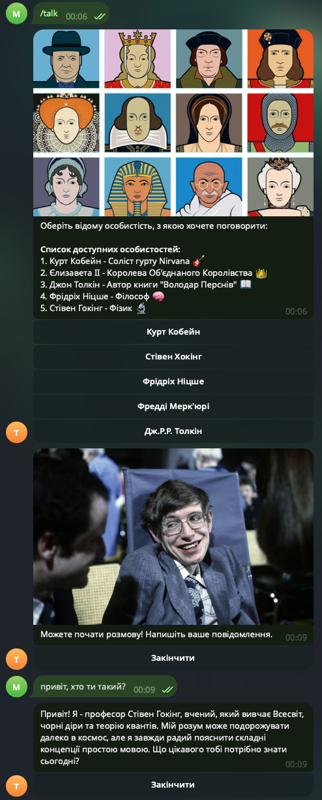
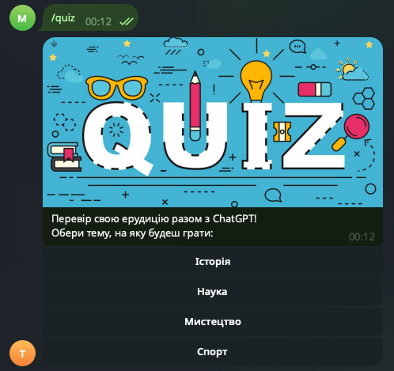
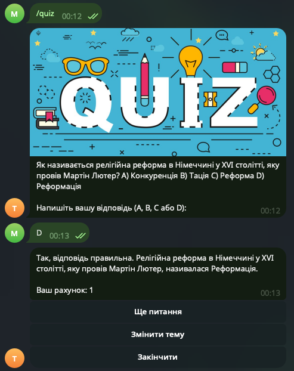

  


# OpenAI Telegram Bot

Telegram bot that integrates with OpenAI to provide various interactive features including random facts, GPT chat interface, and personality-based conversations.

Feel the full power of chatGPT assistant!

## Setup

1. **First, you need to install some dependencies (modules):**
   ```bash
   pip install -r technical_requirements.txt
   ```

2. **Create config file:**
   Create `config.py` with your API keys:
   ```python
   TG_BOT_API_KEY = "your_telegram_bot_token"
   OPENAI_API_KEY = "your_openai_api_key"
   ```

3. **Run the bot:**
   ```bash
   python src/bot.py
   ```
___
## Features

- `/start` - Welcome message with main menu 
- `/random` - Random fact generator with GPT assistant 
- `/gpt` - Direct GPT chat interface  
- `/talk` - Personality-based conversations (Cobain, Hawking, Nietzsche, Queen, Tolkien)
- `/quiz` - Quiz functionality (you can test your knowledge in various fields, such as: history, science, art, sports)
___
## Requirements

- Python 3.7+
- Telegram Bot Token (from @BotFather)
- OpenAI API Key
___
## :construction_worker: Examples of how the bot works

### 1. command "_start_":


---

### 2. command "/random":


---

### 3. command "/gpt":


---

### 4. command "/talk":


### - _I choose "Стівен Хокінг (Stephen Hawking)"_



---

### 5. command "/quiz":


### - _I choose "Історія (History)"_




___

### :white_check_mark: This is not a final version of the telegram-bot, and I will try to improve it in the future when I have more knowledge and skills :)

